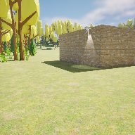

# Project Name  COMP3023w24

## Description

COMP3023  
A github repository for the in class demonstrations.   

Attributions:
1. Audio, Ove - Earth Is All We Have, OveMelaa, Opengameart.org, CC-BY, ( https://opengameart.org/content/oves-essential-game-audio-pack-collection-160-files-updated )
2. Audio, Crystal Cave Song, cynicmusic, Opengameart.org, ( https://opengameart.org/content/crystal-cave-song18) 
3. Audio,Coin, Basto, Opengameart.org, ( https://opengameart.org/content/nes-sounds )
4. Imaqge , Snowy Field , Irina Iriser , pexels-irina-iriser-3416502.jpg ( https://www.pexels.com/photo/photo-of-snow-covered-field-during-dawn-3416502/ )

## Usage
Clone, or download the zip, to a local directory. Open in Unreal Engine 5.3.2 or newer.

